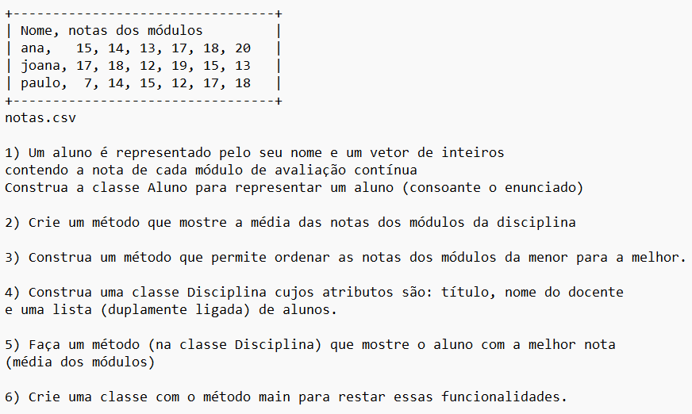

# Vetores-e-Listas
Usando vetores e listas em java

# Relatório Implementação

## Introdução

O Programa é desenvolvido para gerenciar uma lista de alunos de uma disciplina. Ele permite adicionar, remover e pesquisar alunos, além de calcular a média da turma e encontrar o aluno com a maior nota.

O programa foi desenvolvido em **Java** e utiliza uma estrutura de dados chamada **Lista Duplamente Ligada** para armazenar os alunos.

O IDE utilizado foi **Eclipse IDE for Java Developers - 2022-03** .

------------------------------------------------------------------------------------------------------------------------------------------------
## Desenvolvimento
O exercicio pede que seja executado a seguinte implementação 


------------------------------------------------------------------------------------------------------------------------------------------------

### Classes

O programa é composto pelas seguintes classes:

**Aluno**: classe que define os atributos de um aluno (nome, notas e média)

**VectorAluno**: a classe é responsável por representar um vetor de alunos, implementando diversos métodos para manipulação dos dados, como inserir, listar, mostrar media  e ordenar notas de cada aluno

**No**: classe que representa um nó da lista encadeada, contendo a informação do aluno e referências para o próximo e o anterior

**Lista**: classe que implementa a lista duplamente encadeada e contém métodos para adicionar, remover e buscar alunos, além de calcular a média da turma e encontrar o aluno com a maior nota

**Disciplina**: classe que representa uma disciplina, contendo um título, um docente e uma lista de alunos

**Principal**: classe onde temos o método main, que realiza a execução do programa

### Descrição e funcionamento das classes 

** Classe Aluno **
> Classe que define os atributos de um aluno, como nome, notas e média. Os alunos são representados como objetos dessa classe.

+ Nela o nome do aluno é armazenado em uma variável do tipo String e as notas são armazenadas em um array de doubles.

``` 
private String nome 
private double[] notas  
```
+ Nela também possui métodos para acessar e atualizar seus atributos, como getNome, setNome, getNotas e setNotas. Esses métodos permitem que outros objetos possam interagir com um objeto Aluno e alterar seus dados.

```
    public String getNome() 
        return nome

    public int[] getNotas() 
        return notas
    
    public void setNome(String nome) 
		this.nome = nome
	

	public void setNotas(double[] notas) 
		this.notas = notas
	
```
   
+ Tem tambem metodo que mostra a média do aluno é calculada automaticamente quando um objeto Aluno é criado ou quando suas notas são atualizadas.

```
    public double getMedia() 
        double soma = 0;
        for (int nota : notas) 
            soma += nota;
        
        return soma / notas.length;

```
** Classe VectorAluno **
> Essa classe é responsável por representar um vetor de alunos e implementar diversos métodos para manipulação dos dados. Alguns dos métodos disponíveis são: inserir, listar, mostrar a média e ordenar as notas de cada aluno.

+ O construtor da classe VectorAluno recebe um parâmetro, que é o tamanho inicial do vetor de alunos.

```

 public VectorAluno(int tamanho)
        this.alunos = new Aluno[tamanho];
        this.posicao = 0;
        this.tamanho = tamanho;

```
* ** Metodos ** 

*Inserir* : 
O método inserir recebe um objeto Aluno como parâmetro e adiciona esse aluno no vetor. Se o vetor estiver cheio, é redimensionado para o dobro do tamanho atual.

```
public void inserir(Aluno aluno) 
        if (posicao < tamanho) 
            alunos[posicao] = aluno;
            posicao++;
         else 
            System.out.println("Vector cheio!");
        
```

*Listar* : 
O método listar percorre o vetor de alunos e imprime na tela os dados de cada um.

```
 public void listar() 
        for (int i = 0; i < posicao; i++) {
            System.out.println("Nome: " + alunos[i].getNome());
            System.out.print("Notas: ");
            double[] notas = alunos[i].getNotas();
            for (int j = 0; j < notas.length; j++) {
                System.out.print(notas[j] + " ");
            }   System.out.println("\n");
        
    }

```

*Média*: 
O método mostrarMediaNotas calcula e exibe a média das notas de todos os alunos do vetor.


```

public void mostrarMediaNotas() {
    	System.out.println("------------- Media de cada aluno ---------------");
        for (int i = 0; i < posicao; i++) {
            System.out.println("Nome: " + alunos[i].getNome());
            double media = alunos[i].getMedia();
            System.out.printf("Media:"+ media);
            System.out.println("\n");
        }
    }

```

*Ordenar* : 
O método ordenarNotas ordena os alunos do vetor de acordo com as suas notas em ordem decrescente.
Depois de ordenar é chamada o metodo listar() que lista de ordem ordenada;

```
public void ordenarNotas() {
    	System.out.println("------Notas ordenadas de menor para melhor------");
        for (int i = 0; i < posicao; i++) {
            double [] notas = alunos[i].getNotas();
            for (int j = 0; j < notas.length - 1; j++) {
                int indiceMenor = j;
                for (int k = j + 1; k < notas.length; k++) {
                    if (notas[k] < notas[indiceMenor]) {
                        indiceMenor = k;
                    }
                }
                double aux = notas[j];
                notas[j] = notas[indiceMenor];
                notas[indiceMenor] = aux;   
            }
        }
        listar();
    }

```

*Pesquisar* :
O método buscarAluno busca um aluno no vetor a partir de seu nome e retorna o índice desse aluno no vetor. Caso o aluno não seja encontrado, retorna null.

```
public Aluno pesquisar(String nome) {
        for (int i = 0; i < posicao; i++) {
            if (alunos[i].getNome().equals(nome)) {
                return alunos[i];
            }
        }
        return null;
    }

```

*lerAlunosDoArquivo* : 
O método lerAlunosDoArquivo recebe como parâmetro o nome de um arquivo e realiza a leitura do mesmo, armazenando as informações lidas em objetos Aluno e inserindo esses objetos no vetor de alunos. Esse método é capaz de ler arquivos no formato csv, onde cada linha representa as informações de um aluno, sendo o nome do aluno a primeira coluna e as notas as demais colunas separadas por ponto-e-vírgula.

```
    public void lerAlunosDoArquivo(String nomeArquivo) {
        try {
            File fich = new File(nomeArquivo);
            FileReader lerfich = new FileReader(fich);
            Scanner ler = new Scanner(lerfich);
            ler.nextLine(); //
            
            while (ler.hasNextLine()) {
                String linha = ler.nextLine();
                String[] v = linha.split(";");
                String nome = v[0];
                double[] notas = new double[6];
                for (int i = 1; i < v.length; i++) {
                    notas[i - 1] = Integer.parseInt(v[i]);
                }
                Aluno aluno = new Aluno(nome, notas);
                inserir(aluno);
            }
            ler.close();
        } catch (Exception e) {
            e.printStackTrace(); // método util que achei para exibir informações sobre o erro.
        }
    }

```
*tamanho e get* :
O método tamanho retorna o tamanho máximo do vetor de alunos.

O método get recebe como parâmetro um índice inteiro e retorna o objeto Aluno que se encontra na posição correspondente desse índice. É possível obter informações cada aluno, como seu nome, notas e média, para realizar operações como a pesquisa de um aluno específico ou a impremir suas informações.

```
 public int tamanho() {
        return alunos.length;
    }
    public Aluno get(int i) {
        if (i>= 0 && i < tamanho) {
            return alunos[i];
        } else {
            System.out.println ("Índice inválido: " + i);
        }
    }

```
** Classe No **
> Classe que representa um nó da lista encadeada, contendo a informação do aluno e referências para o próximo e o anterior.

```
public class No {
    private No anterior;
    private No proximo;
    private Aluno info;

    public No(Aluno info) 
        this.info = info;

    public No getAnterior()
        return anterior;

    public void setAnterior(No anterior) 
        this.anterior = anterior;
   

    public No getProximo()
        return proximo;
    
    public void setProximo(No proximo)
      this.proximo = proximo;

    public Aluno getInfo()
        return info;

    public void setInfo(Aluno info)
        this.info = info;

```

** Classe Lista **
> Classe que implementa a lista duplamente encadeada e contém métodos para adicionar, remover e buscar alunos. Além disso, essa classe pode calcular a média da turma e encontrar o aluno com a maior nota.

Ela possui os seguintes atributos:

- primeiro: representa o primeiro nó da lista
- ultimo: representa o último nó da lista
- tamanho: representa o número de elementos na lista

A classe possui um construtor padrão que inicializa os atributos primeiro e ultimo como null e tamanho como 0.

```
public class Lista {
    private No primeiro;
    private No ultimo;
    private int tamanho;

    public Lista() {
        this.primeiro = null;
        this.ultimo = null;
        this.tamanho = 0;
    }

```
Métodos
A classe Lista possui os seguintes métodos:

getInicio()
Retorna o primeiro nó da lista.

```
public No getInicio() {
        return primeiro;
    }

```

isVazia()
Retorna um valor booleano indicando se a lista está vazia ou não.

```
 public boolean isVazia() {
        return (this.primeiro == null);
    }

```
tamanho()
Retorna o tamanho da lista.

```
public int tamanho() {
        return this.tamanho;
    }

```
adicionarAluno(Aluno aluno)
Adiciona um objeto Aluno ao final da lista. Para isso, cria um novo nó com o objeto Aluno e o adiciona após o último nó existente na lista.

```
public void adicionarAluno(Aluno aluno) {
        No novoNo = new No(aluno);
        if (primeiro == null) {
            primeiro = novoNo;
        } else {
            No atual = primeiro;
            while (atual.getProximo() != null) {
                atual = atual.getProximo();
            }
            atual.setProximo(novoNo);
            novoNo.setAnterior(atual);
        }
        tamanho++;
    }

```


**inserirInicio(Aluno aluno)**
Adiciona um objeto Aluno no início da lista. Para isso, cria um novo nó com o objeto Aluno e o adiciona antes do primeiro nó existente na lista.


**inserirFinal(Aluno aluno)**
Adiciona um objeto Aluno ao final da lista. Para isso, cria um novo nó com o objeto Aluno e o adiciona após o último nó existente na lista.

**removerInicio()**
Remove o primeiro nó da lista.

**removerFinal()**
Remove o último nó da lista.

**inserirPos(int posicao, Aluno aluno)**
Adiciona um objeto Aluno em uma posição específica da lista. Para isso, cria um novo nó com o objeto Aluno e o adiciona na posição especificada, empurrando os nós seguintes para a direita.

**removerPos(int posicao)**
Remove o nó em uma posição específica da lista, deslocando os nós seguintes para a esquerda.

getNo(int posicao)
Retorna o nó que está na posição especificada na lista. O método percorre a lista, começando com o primeiro nó, até atingir o nó na posição desejada.

```
    private No getNo(int posicao) {
        No atual = primeiro;
        for (int i = 0; i < posicao; i++) {
            atual = atual.getProximo();
        }
        return atual;
    }

```


** Classe Disciplina **
> Classe que representa uma disciplina, contendo um título, um docente e uma lista de alunos. Essa classe possui métodos para adicionar alunos à disciplina e para encontrar o aluno com a maior nota.

Ela possui os seguintes atributos:

- titulo (tipo String, privado): o título da disciplina.
- docente (tipo String, privado): o nome do professor responsável pela disciplina.
- listaAlunos (tipo Lista, privado): uma lista encadeada que armazena os alunos matriculados na disciplina.

```

public class Disciplina {
    private String titulo;
    private String docente;
    private Lista listaAlunos;

```


O construtor da classe recebe como parâmetros o título e o nome do professor da disciplina e inicializa a lista de alunos com uma nova instância de Lista.

```
    public Disciplina(String titulo, String docente) {
        this.titulo = titulo;
        this.docente = docente;
        this.listaAlunos = new Lista();
    }

```

A classe também possui os seguintes métodos :

+ -- **getTitulo()** (retorna o título da disciplina).

+ -- **setTitulo(String titulo)** (atualiza o título da disciplina com o valor passado como parâmetro).

+ -- **getDocente()** (retorna o nome do professor da disciplina).

+ -- **setNomeDocente(String docente)** (atualiza o nome do professor da disciplina com o valor passado como parâmetro).

+ -- **getListaAlunos()** (retorna a lista de alunos matriculados na disciplina).

+ -- **setListaAlunos(Lista listaAlunos)** (atualiza a lista de alunos matriculados na disciplina com a lista passada como parâmetro).

**adicionarAlunos(VectorAluno vetor)** (adiciona à lista de alunos da disciplina os alunos contidos no vetor aluno como parâmetro).

```
 public void adicionarAlunos(VectorAluno vetor) {
        for (int i = 0; i < vetor.tamanho(); i++) {
            Aluno aluno = vetor.get(i);
            listaAlunos.adicionarAluno(aluno);
        }
    }

```
alunoComMelhorNota() (retorna o aluno com a melhor nota na disciplina, ou null caso não haja alunos matriculados).
O método alunoComMelhorNota busca o aluno com a melhor nota na disciplina por meio de uma iteração sobre a lista de alunos.
Se a lista estiver vazia, o método imprime uma mensagem de erro e retorna null.
Caso contrário, o método compara as médias de cada aluno com a média do melhor aluno encontrado até o momento. Se a média do aluno atual for maior, ele se torna o novo melhor aluno. Ao final da iteração, o método imprime o nome do aluno com a melhor média e sua média aritmética. O melhor aluno encontrado é retornado.

```
public Aluno alunoComMelhorNota() {
        if (listaAlunos.isVazia()) {
            System.out.println("Nao a alunos na disciplina!");
            return null;
        }
        
        No atual = listaAlunos.getInicio();
        Aluno melhorAluno = atual.getInfo();
        double melhorMedia = melhorAluno.getMedia();
        
        while (atual != null) {
            double mediaAtual = atual.getInfo().getMedia();
            if (mediaAtual > melhorMedia) {
                melhorAluno = atual.getInfo();
                melhorMedia = mediaAtual;
            }
            atual = atual.getProximo();
        }
        
        System.out.println("Aluno com a melhor media na disciplina e " + melhorAluno.getNome() );
        System.out.printf("Media: %.2f\n", melhorMedia);
        return melhorAluno;
    }

```

** Classe Principal **
> Classe que contém o método main, que realiza a execução do programa. Essa classe é responsável por instanciar as outras classes e chamar seus métodos para executar as operações necessárias.

- [X] Cria um objeto VectorAluno chamado alunos com uma capacidade inicial de 3 elementos.

- [X] Chama o método lerAlunosDoArquivo do objeto alunos passando o nome do arquivo "notas.csv". Esse método lê os dados do arquivo e adiciona os alunos no vetor alunos.

- [X] Chama o método listar do objeto alunos. Esse método imprime na tela os dados de todos os alunos do vetor alunos.
  
- [X] Chama o método ordenarNotas do objeto alunos. Esse método ordena os alunos do vetor alunos em ordem crescente de média de notas.

- [X] Chama o método mostrarMediaNotas do objeto alunos. Esse método imprime na tela a média das notas de todos os alunos do vetor alunos.

- [X] Cria um objeto Disciplina chamado disciplina com o título "CAA-CP" e o docente "Valerio".

- [X] Chama o método adicionarAlunos do objeto disciplina, passando o vetor alunos. Esse método adiciona todos os alunos do vetor alunos na lista de alunos da disciplina.

- [X] Chama o método alunoComMelhorNota do objeto disciplina. Esse método encontra o aluno com a melhor média na lista de alunos da disciplina e o imprime na tela.

```
public class Principal {

	public static void main(String[] args) {
		
		VectorAluno alunos = new VectorAluno(3);
		alunos.lerAlunosDoArquivo("notas.csv");
		alunos.listar();
        alunos.ordenarNotas();
        alunos.mostrarMediaNotas();
        Disciplina disciplina = new Disciplina("CAA-CP", "Valerio");
        disciplina.adicionarAlunos(alunos);
        disciplina.alunoComMelhorNota();
    }
}

```

## Conclusão

Em geral o Programa faz a gestão de Alunos para gerenciar alunos de uma disciplina. Utilizando a estrutura de dados de lista duplamente ligada, é possível armazenar e manipular os dados de forma organizada e flexível.


- Universidade de Santiago
- Conceção e Analise de Algoritmo
- Aluno: Admilson de Pina-5154 
- Docente: Valerio Santos

